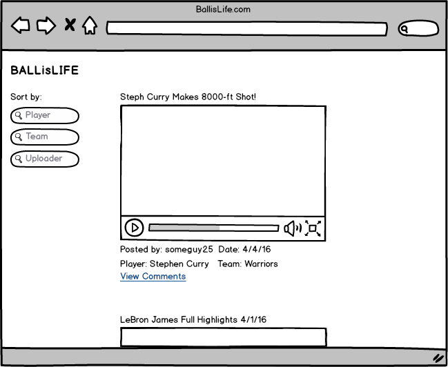
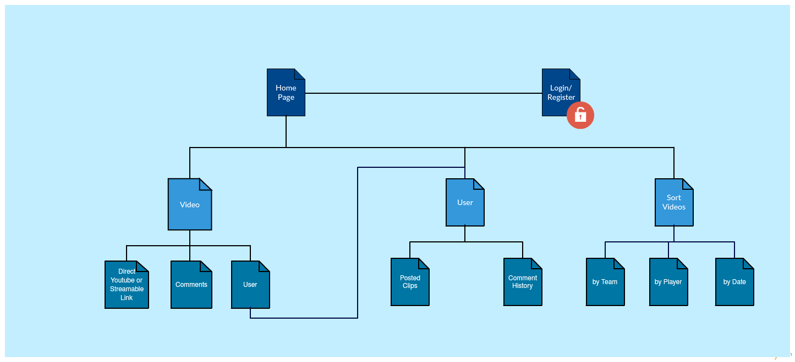

# Ball is Life

## Overview

As someone who likes to watch basketball clips and highlights, it would be cool to have a site dedicated to just that. BallisLife.com will be a website where users can post different basketball clips they find on the web (Youtube and Streamable videos supported) and then view them and discuss them (think of a more streamlined nba reddit.)

Each user can have their own page displaying their posted clips, and can also view a main page of all clips posted, with options to sort by player, team, date(?), etc. There will also be the option to comment on each clip.


## Data Model

Minimally, we'll have to store Users, Clips, and Comments

* users can have multiple videos
* videos can have multiple comments

First draft schema:

```javascript
// Users
// * username and password for authentication
// * keep track of clips they've posted
var User = new mongoose.Schema({
  // username, password done through Passport.js
  clips:  [{ type: mongoose.Schema.Types.ObjectId, ref: 'Clip' }]
});

// a Clip posted by a user
// A lot of stuff to keep track of
// * Name
// * URL
// * Team(s) involved
// * Player(s) involved
// * Time posted
// * User who posted it
// * Comments
var Item = new mongoose.Schema({
	name: {type: String, required: true},
	url: {type: String, required: true},
    team: [{type: String, required: true}],
    player: [{type: String, required: true}],
    createdAt:  {type: Date, required: true},
    user: {type: mongoose.Schema.Types.ObjectId, ref:'User'},
    comments: [Comment]
});

// a Comment
// has text, a user who posted it, and time posted
var Comment = new mongoose.Schema({
  user: {type: mongoose.Schema.Types.ObjectId, ref:'User'},
  text: {type: String, required: true},
  createdAt: {type: Date, required: true};
});
```

## Wireframes
* This has changed slightly, since my original plan was a bit too ambitious (as they usually are)



## Sitemap
* This has changed slightly, since my original plan was a bit too ambitious (as they usually are)



## Use Cases

* Watch a video
    * As a user, I want to watch clips embedded in the page by clicking play
* Submitting a video
    * As a user, I want to enter the youtube link to a video, a title, and the team it's associated with, and have that added to the database
* Read/Write comments
    * As a user watching a clip, I want to read other user's comments on the clip
    * As a user writing a comment, I want to see the other comments, as well as what I am commenting
* Sorting clips
    * As a user sorting clips, I want to view them sorted by team of the player they involve
* Viewing user
    * As a user viewing the profile of another user, I want to see the clips they've posted, as well as basic information about them

## Research Topics

* (3 points) Integrate user authentication
    * Passport sounds cool, I will check it out and hopefully implement it
* (1 point) Grunt
    * (1 point) With minification for faster loading
    * (1 point) and a CSS preprocessor (SASS)
* ... for a total of 6 points
